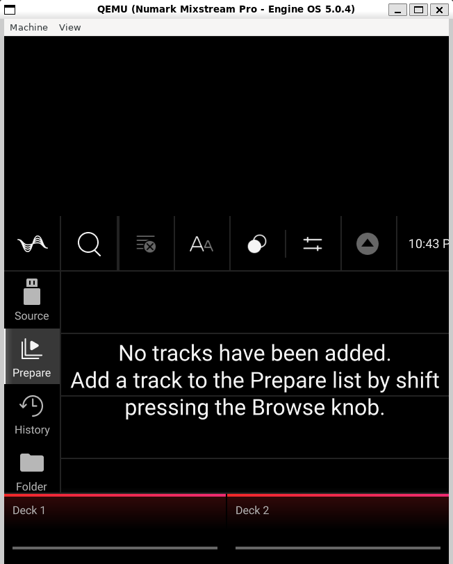

# engine-os-emu

Reverse engineering of inMusic's **AZ01** firmware container, and booting **Engine OS** (the
system that runs on the Numark Mixstream Pro) end to end under QEMU on an x86 machine.

The container format was decoded from scratch, the ARM rootfs extracted, and the whole system
brought up under emulation until the Engine DJ interface rendered on screen and responded to
touch input. [TEARDOWN.md](TEARDOWN.md) is the full write-up: container layout, kernel, device
tree, boot chain, and every obstacle that had to be diagnosed along the way.

No firmware is included in this repository. See [Obtaining the firmware](#obtaining-the-firmware).

## Status

| Goal | Result |
|---|---|
| Extracting the firmware from the AZ01 container | done, SHA-1 verified |
| Running ARM binaries on x86 (qemu-user chroot) | done |
| Full Engine OS boot under QEMU (systemd, network, SSH) | done |
| Device console visible and interactive in a window | done, WSLg/GTK |
| Product identification (injected device tree) | done, NH08 / AZ05rA |
| virtio GPU plus DRM/KMS inside the VM | done |
| Engine application startup (Qt, QML, SceneGraph, MIDI) | done |
| **Engine DJ graphical interface on screen** | **working** |
| "Incompatible Format" dialog at startup | removed with a udev rule |
| **Interface navigable with mouse and touch** | **working** |
| Audio, control surface, jog wheels | not possible, the physical hardware is absent |



## Obtaining the firmware

The update image is proprietary inMusic material and is **not** distributed here. You have to
download it yourself from the manufacturer:

1. Get the Mixstream Pro updater for Engine DJ OS 5.0.4 from the official Numark support site:
   [Engine DJ Updates and Releases](https://support.numark.com/en/support/solutions/folders/69000636315),
   see also [How to Update Engine DJ OS](https://support.numark.com/en/support/solutions/articles/69000833677-numark-how-to-update-engine-dj-os).
2. The download is a Windows updater executable. The `.img` container is embedded in it and is
   written out when the updater runs.
3. Place `MIXSTREAMPRO-5.0.4-Update.img` in the root of this repository.

Confirm you have the same input this teardown was written against:

```
MIXSTREAMPRO-5.0.4-Update.img    182367344 bytes
  SHA-256  e642aaa686138d25a4e192b4afcdb51f1730d601ef8807bd4dfafadc40d6e995

Mixstream Pro 5.0.4 Updater.exe  175729032 bytes
  SHA-256  86e375d555b862b375577fcb1b45e5310b34740af60265a0aa45f85723ad8998
```

A different firmware version will still extract, since the container parser is generic, but the
offsets, hashes and log excerpts quoted in the teardown refer to 5.0.4.

## Quickstart

Everything runs on an x86 Linux host. WSL2 on Windows is what this was developed on. The steps
below need root, because they mount images and use loop devices.

```bash
apt-get install -y qemu-system-arm qemu-user-static binfmt-support \
                   cpio xz-utils device-tree-compiler curl gcc-arm-linux-gnueabihf

# 1. Unpack the AZ01 container and decompress the rootfs
python3 _tools/az01-extract.py MIXSTREAMPRO-5.0.4-Update.img _extracted
xz -dc _extracted/02_rootfs.bin > _extracted/rootfs.img

# 2. Build the VM. Downloads the Debian armhf kernel and busybox, builds the
#    disks and the patched device tree, generates the guest SSH key.
bash _tools/vm-build.sh

# 3. Boot it, then start the Engine application inside it
bash _tools/vm-run.sh
bash _tools/engine-run.sh
```

Then watch it, either in the browser at `http://localhost:6080/vnc.html?autoconnect=true&resize=scale`,
or in a native window on the Windows desktop:

```powershell
powershell -File _tools\vm-window.ps1
```

The native window is considerably more responsive than noVNC, because it skips the encode,
websocket and canvas redraw round trip on every frame.

## Running it on macOS, or on any non-Linux host

The steps above need a Linux host: loop devices to patch the rootfs image, an armhf cross
compiler for the shims, and root. `docker/` packages all of that in a privileged Debian
container, so the host only has to run Docker. On Apple Silicon the container itself is native
arm64 and only the armhf guest is emulated.

```bash
bash docker/eos.sh all
```

That downloads and verifies the firmware, builds the container image, unpacks the container,
builds the VM, boots it, and starts Engine. Individual steps (`fetch`, `image`, `up`, `extract`,
`build`, `boot`, `engine`, `shot`, `vssh`, `status`, `stop`, `clean`) can be run on their own;
`bash docker/eos.sh` with no argument lists them.

There is no X11, so the display is VNC: the browser at
`http://localhost:6080/vnc.html?autoconnect=true&resize=scale`, or a native client at
`vnc://localhost:5902` (on macOS, Screen Sharing), which is the more responsive of the two.

`_extracted` and `_vm` are kept in Docker volumes rather than on the bind mount. QEMU does
scattered small block I/O and every request would otherwise pay a VirtioFS round trip: the same
problem `vm-fastdisk.sh` solves on WSL.

To inspect the ARM userland without booting anything, there is also a qemu-user chroot:

```bash
bash _tools/az01-chroot.sh            # interactive shell in the ARM system
bash _tools/az01-chroot.sh az0x-info  # or run a single command
```

## Rendering performance (optional)

Drawing is done entirely in software on an emulated ARM CPU, so it is slow. Two things help, and
neither is obvious from the file names alone:

```bash
bash _tools/vm-fastdisk.sh on       # move the disk images onto ext4
bash _tools/mesa-upgrade.sh         # sideload a Mesa build that has llvmpipe and virgl
MESA24=1 bash _tools/engine-run.sh  # run Engine against it
bash _tools/engine-bench.sh         # compare, by counting DRM page flips
```

`vm-fastdisk.sh` exists because `_vm` normally sits on drvfs, the 9p bridge between WSL2 and
Windows. Sequential throughput is fine there, but every request pays a round trip, and QEMU does
scattered small block I/O: loading the Qt libraries and the QML files means thousands of small
requests.

**Caveat:** while fast disks are active, guest writes go to the copies under `/opt/az01-vm`. Run
`bash _tools/vm-fastdisk.sh off` to copy them back to `_vm`. Stop the VM before either operation.

`mesa-upgrade.sh` exists because the rootfs ships Mesa 24.0.7 without libLLVM, so
`kms_swrast_dri.so` only contains softpipe, the reference rasterizer. Mesa also looks for a virgl
driver for QEMU's virtio-gpu, fails to find it, and falls back. The script installs the Ubuntu
24.04 armhf drivers under `/opt/mesa24` and leaves the originals untouched as a fallback.

It is worth the trouble, and it is the only thing that is. Measured with `engine-bench.sh`, in
the container on an M-series Mac:

| configuration | first frame | frames in the next 60 s |
|---|---|---|
| softpipe (rootfs drivers) | 42 s | 29 |
| **llvmpipe** (`/opt/mesa24`) | 31 s | 165 - 209 |
| llvmpipe, 8 vCPUs | 71 s | 86 |
| llvmpipe, `tb-size=1024`, `cache=unsafe` | 31 s | 205 |
| llvmpipe, `LP_NATIVE_VECTOR_WIDTH=256` | 31 s | 188 |
| llvmpipe, scanout at 640x400 | 31 s | 636 - 764 |

Read that table with the spread in mind: repeated runs of the *same* configuration land anywhere
between 165 and 209 frames, so anything inside ~25% is noise.

Where the time actually goes settles which knobs can matter at all. Summing the per-thread CPU
time of the Engine process:

| thread | share |
|---|---|
| `llvmpipe-0..3` | ~95% |
| `SceneGraph` | 3% |
| `EMain` and everything else | 2% |

Rasterisation is the whole cost, and the four rasterizer threads are evenly loaded, so only two
things can move the number: fewer pixels, or moving the rasterising off the emulated CPU.

- **llvmpipe instead of softpipe: about 6x.** The one change worth making.
- **Fewer pixels scale almost exactly.** A 640x400 scanout is a quarter of the pixels and gives
  3.3x to 3.8x the frames. It is *not* offered as a default: Engine lays its interface out in
  fixed pixels for the 800x1280 panel, so a smaller scanout clips the interface rather than
  scaling it, and the sidebar loses entries. `XRES`/`YRES` are there for when responsiveness
  matters more than seeing all of it.
- **More vCPUs make it worse.** llvmpipe runs one rasterizer thread per guest CPU, so 8 looks
  like the obvious next step. It halves the frame rate and doubles the time to first frame: QEMU's
  multi-threaded TCG pays more in cross-CPU synchronisation than the extra threads bring in. The
  host is not the constraint either, 4 vCPUs already leave it 70% idle.
- `tb-size`, `cache=unsafe` and a 256-bit llvmpipe vector width all come out inside the noise.

`vm-run.sh` takes `SMP`, `MEM`, `TB`, `CACHE`, `XRES` and `YRES` from the environment, and
`engine-run.sh` takes `EXTRA_ENV`, so the same comparison can be repeated on other hardware
without editing anything.

## Why this cannot be made fast

The structural fix would be **virgl**, which hands the guest's OpenGL to the host GPU
(`vm-run.sh --gl`). It needs a DRM render node, so it wants real Linux with a GPU. In a container
on macOS the hypervisor's kernel carries no GPU driver at all, `/dev/dri` does not exist and
neither `vgem` nor `vkms` can be loaded, so QEMU's `egl-headless` refuses to start with *"no drm
render node available"*.

The other half of the answer is the CPU. [cdj3k-emu](https://github.com/nsaintot/cdj3k-emu),
which emulates a comparable device, runs at native speed on Apple Silicon because its target is
an **aarch64** SoC: it can use Hypervisor.framework and never enters TCG. The Mixstream Pro is a
32-bit ARMv7 device, and Apple Silicon cores do not execute AArch32 at all, not even in userspace.
There is no hardware virtualisation path for this firmware on that host, so the emulated CPU is a
floor rather than a tuning problem, and software rasterising a 1 megapixel Qt scene on top of it
is what the frame rate reflects.

Two things about that sideload are less obvious than they look, and both are handled by the
script:

- **Only the `noble` release pocket.** noble shipped Mesa 24.0.5, the same series as the rootfs,
  but `noble-updates` has since moved to the 25.x HWE stack. From 24.3 on, Mesa replaced the
  classic DRI megadriver with `libdril_dri.so`, whose entry points the guest's own libEGL cannot
  bind: Engine dies at startup on *"did not find extension DRI_Mesa version 1"*.
- **The build string is rewritten.** Since 24.0, libEGL compares the driver's Mesa version with
  its own using `strcmp`, and the distributions stamp the full package version into it. Ubuntu's
  `24.0.5-1ubuntu1` can therefore never satisfy a Yocto `24.0.7`, and no Ubuntu release ever
  shipped 24.0.7 to begin with. The script rewrites the string in the staged drivers in place,
  same length, NUL padded. The check guards the DRI interface, which does not change between
  maintenance releases of one stable series.

## What will never work under emulation

Audio (a custom I2S codec plus a separate XMOS DSP), the control surface (MIDI over UART to
dedicated microcontrollers), jog wheels, motors, pads, and the ilitek touch panel are physical
circuits of the device, not software. The update image also contains only the splash screens and
the rootfs: no bootloader, no `/data` partition, no user content.

Section 10 of [TEARDOWN.md](TEARDOWN.md) lists these in detail.

## Tools

| File | Purpose |
|---|---|
| `_tools/az01-extract.py` | parser and extractor for the AZ01 container |
| `_tools/splash2png.py` | converts the raw BGRA splash screens to rotated PNG |
| `_tools/az01-chroot.sh` | mounts the rootfs as an overlay and enters the ARM chroot |
| `_tools/vm-build.sh` | builds the whole armhf QEMU VM: kernel, initramfs, disks, DTB, patches |
| `_tools/vm-run.sh` | starts and stops the VM, opens an SSH shell, captures the screen |
| `_tools/vm-wait.sh` | waits until the guest answers over SSH, meaning the boot is finished |
| `_tools/vm-window.ps1` | runs the whole thing in a native QEMU window on the Windows desktop |
| `_tools/vm-fit.sh` | sizes and focuses the QEMU window, acting on the X window |
| `_tools/engine-run.sh` | starts Engine inside the VM, with all the shims it needs |
| `_tools/drmspy.c` | LD_PRELOAD shim that intercepts the DRM ABI and rewrites the pixel format |
| `_tools/uinput-touch.c` | bridge from the virtio tablet to a real multitouch device via `/dev/uinput` |
| `_tools/touch-run.sh` | installs the bridge in the guest, sends synthetic taps, shows its log |
| `_tools/mesa-upgrade.sh` | sideloads the Ubuntu 24.04 armhf Mesa drivers into the guest |
| `_tools/engine-bench.sh` | measures how fast Engine draws, by counting page flips |
| `_tools/vm-fastdisk.sh` | moves the disk images between the Windows and Linux filesystems |
| `_tools/ppm2png.py` | converts QEMU monitor screendumps to PNG |
| `docker/Dockerfile` | Linux toolchain image: QEMU, armhf cross compiler, noVNC |
| `docker/eos.sh` | drives the whole pipeline inside that container, from a non-Linux host |

## Credits

The breakthrough on the graphical interface came from
[nsaintot/cdj3k-emu](https://github.com/nsaintot/cdj3k-emu), which boots the firmware of another
Rockchip based, Qt based DJ player under QEMU. Its `ep122_shim` established the approach used
here: do not fight the virtual GPU, intercept the DRM/KMS ABI with an LD_PRELOAD instead.
`_tools/drmspy.c` is a direct application of that idea.

## License and disclaimer

The original work in this repository is MIT licensed. See [LICENSE](LICENSE).

This project is **unofficial**. It is not affiliated with, authorized by, or endorsed by inMusic
Brands, Numark or Engine DJ. It documents interoperability and security research carried out on
publicly distributed firmware for a device owned by the author.

No vendor code, firmware or asset is redistributed here. The Engine application, its QML, and the
module firmware remain proprietary.
